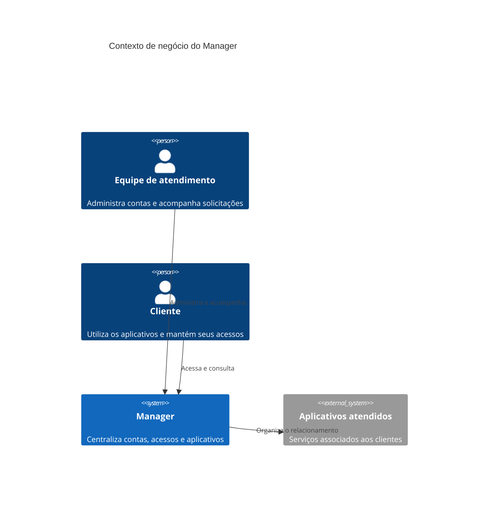

# RFC 001 - Manager: Plataforma de Gestão de Contas

**Status:** Aprovado  
**Data:** 2026-09-05

## Cenário

Organizações que atendem diversos clientes precisam administrar contas, responsáveis e aplicativos de forma organizada. Quando essas informações ficam distribuídas entre ferramentas ou processos manuais, a equipe perde tempo para localizar dados, acompanhar solicitações e manter os acessos atualizados.

## Problema identificado

A ausência de uma visão central dificulta o acompanhamento do ciclo de vida das contas. Isso aumenta a dependência de atividades manuais, reduz a transparência sobre quem possui acesso e torna mais difícil atender clientes com consistência.

## Proposta de solução

O Manager oferece uma central única para administrar contas, acessos e aplicativos vinculados a cada cliente. A proposta é permitir que as equipes acompanhem responsabilidades, mantenham os dados organizados e apoiem os usuários durante todo o relacionamento com a plataforma.

## Alternativas consideradas

### Gestão isolada por cliente

Manter processos e controles separados para cada cliente reduz a capacidade de acompanhamento central e aumenta o esforço de operação.

### Controle manual em documentos compartilhados

Documentos manuais oferecem baixo custo inicial, mas não acompanham adequadamente mudanças de acesso, responsabilidades e solicitações recorrentes.

### Plataforma centralizada

Uma plataforma única permite padronizar o atendimento, concentrar informações e oferecer uma experiência mais previsível para clientes e equipes.

## Decisão

Adotar o Manager como plataforma central para a gestão de contas, acessos e aplicativos dos clientes. A decisão prioriza visibilidade operacional, organização do atendimento e evolução contínua do serviço.
