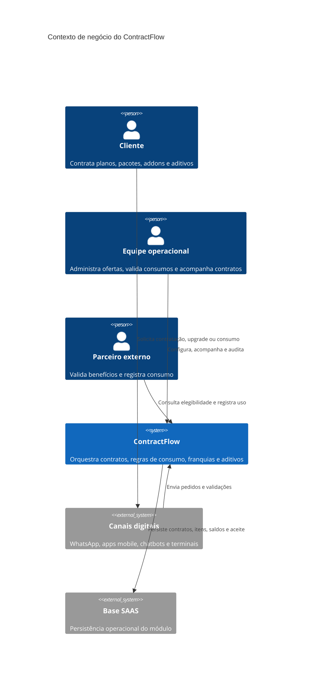

# RFC 002 - ContractFlow: Gestão Dinâmica de Contratos e Franquias

**Status:** Aprovado  
**Data:** 2026-09-06

## Cenário

A operação demanda um modelo de comercialização dinâmico e multicanal, capaz de atender serviços recorrentes, locações, pacotes de experiências, turismo, excursões com kits sob medida e serviços adicionais consumidos durante a execução do contrato.

Esse modelo exige flexibilidade para alterar planos em andamento, emitir aditivos instantâneos, aplicar regras de desconto de parceiros em tempo real e rastrear o consumo individual de itens, franquias e benefícios com confiabilidade.

## Problema identificado

Sistemas tradicionais de gestão contratual funcionam como repositórios estáticos de documentos. Essa abordagem gera gargalos operacionais relevantes:

- Perda de receita por dificuldade em tarifar e cobrar consumos avulsos ou extras contratados no decorrer do serviço ou evento.
- Atrito na experiência do cliente por rigidez para processar upgrades, trocas de pacote ou aditivos rápidos, como compras via WhatsApp durante uma viagem.
- Falta de rastreabilidade operacional no controle individual do uso de franquias e benefícios em parceiros externos, gerando divergências em repasses financeiros e auditorias.
- Custo elevado de customização quando cada novo produto, pacote ou modelo comercial exige alterações estruturais no sistema.

## Proposta de solução

Implementar o ContractFlow como uma aplicação do Manager para orquestração de contratos, precificação e regras de consumo. O módulo deve seguir a organização vertical já aplicada em Manager e Support, separando controllers, views, models, metadata, APIs e regras estáticas por domínio.

A identificação funcional do módulo deve usar `Contract` quando representar a aplicação ou camada de interface, e `CTR` quando representar tabelas, modelos e metadados do domínio de contratos:

- `App\Controllers\Contract`
- `App\Views\SBAdmin\Contract`
- `App\Models\CTR`
- `App\Metadata\CTR`
- `App\Controllers\API\V1\Contract`
- `App\Static\Rules\Contract`

O ContractFlow deve atuar como motor central do ciclo de vida das vendas e entregas:

- Flexibilidade total de ofertas, com suporte a pacotes compostos, kits, itens avulsos, gratuidades condicionais e serviços dependentes em um único contrato.
- Consumo em tempo real, com abatimento de saldo por leitura de QR Code ou validação de sistema para vouchers, consumo a bordo, franquias de acesso e benefícios de parceiros.
- Vendas sem atrito, permitindo contratos adicionais ou aditivos em segundos via canais digitais, mantendo governança e aceite legal.
- Governança de transição, com substituição automática de planos por upgrade ou downgrade e garantia de execução apenas dos contratos vigentes.

## Alternativas consideradas

### Customização do ERP atual

Rejeitada pelo custo de desenvolvimento, rigidez da arquitetura legada e tempo elevado de resposta para validações em tempo real.

### Contratação de soluções verticalizadas

Rejeitada por fragmentar dados, duplicar custos recorrentes, elevar o TCO e reduzir a padronização entre diferentes domínios de negócio.

### Plataforma institucional unificada

Selecionada por concentrar contratos, precificação, consumo e governança em um único motor, preservando consistência operacional e reduzindo o esforço para lançar novos modelos comerciais.

## Decisão

Avançar com o desenvolvimento e implantação do ContractFlow como motor institucional único para governança de contratos, precificação, aditivos e controle de consumo.

O módulo deve ser implementado como uma aplicação vertical do Manager, usando a identificação `Contract` ou `CTR` conforme a responsabilidade técnica da camada.
