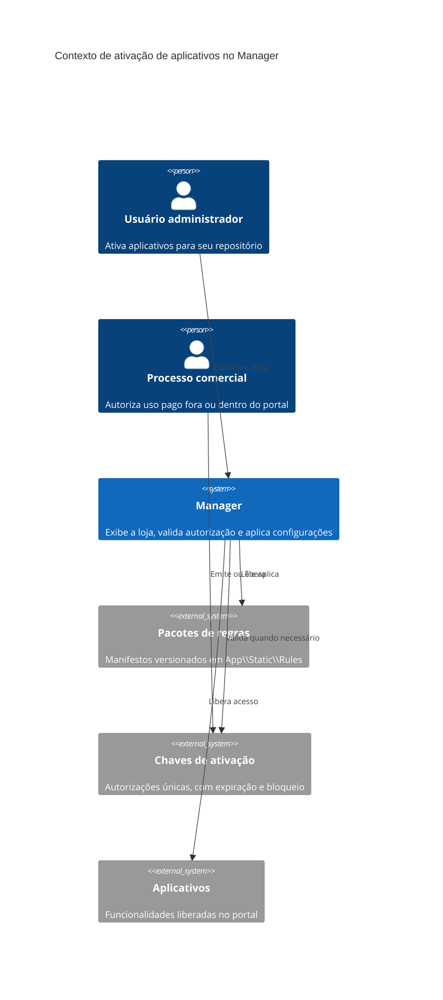

# RFC 003 - Ativação de Aplicativos e Módulos

**Status:** Rascunho  
**Data:** 2026-09-07

## Cenário

O portal deve oferecer uma loja de aplicativos para que cada repositório possa ativar produtos contratados ou gratuitos. Para o usuário, essa ação deve parecer uma instalação simples: ele acessa uma tela, escolhe o aplicativo e clica em `Ativar`. Tecnicamente, o sistema não instala código novo; ele libera funcionalidades já implementadas por meio de cadastros, menus, perfis, permissões e parâmetros.

O fluxo atual usa a tela `/Support/Package`. Nela, o usuário informa uma chave de pacote, o sistema localiza um arquivo JSON em `App\Static\Rules`, valida produto e versão e executa instruções para inserir dados em tabelas como `CasApp`, `CasRpa`, `CasPrg`, `CasFun`, `CasFpr`, `CasMdl`, `CasMpr`, `CasMnu`, `CasMna`, `CasPfi`, `CasPfu`, `CasApf` e `CasAfu`.

Esse mecanismo já resolve parte importante do problema: transformar um pacote versionado em configuração inicial do repositório. Porém, a experiência e o controle comercial ainda não estão adequados para uma loja de aplicativos.

## Problema identificado

O fluxo atual mistura três responsabilidades diferentes em uma única tela: descoberta do produto, validação de contratação e aplicação técnica do pacote. Isso cria atrito para o usuário e dificulta a evolução do portal como uma loja de aplicativos.

A tela `/Support/Package` também nasceu com finalidade de suporte e atualização. Por isso, sua linguagem e sua mecânica são mais próximas de uma rotina técnica do que de um catálogo de produtos. O usuário precisa saber ou receber uma chave antes de descobrir claramente o aplicativo.

Existe ainda um conflito importante na chave do produto. O pacote JSON fica em `App\Static\Rules`, dentro do próprio sistema. Se a chave usada para validar o pacote for o próprio `ProductKey` do arquivo ou o código do aplicativo em `CasApp`, todos os repositórios que tiverem acesso à tela poderão usar a mesma chave para ativar o produto. Isso não serve como controle comercial individual.

Levar o JSON para `Repositories\<CasRpsCod>` resolveria a individualidade física do pacote, mas criaria duplicação de arquivos, risco de divergência entre repositórios e maior custo de manutenção. O pacote deve continuar central e versionado no código da aplicação.

Também há limitação técnica no carregamento atual dos pacotes. O trait `DataPackage` está direcionado ao pacote do Manager, com caminho baseado em `App\Static\Rules\Manager` e nome composto por `APP_NAME` e `APP_VERSION`. Isso impede usar naturalmente pacotes como `App\Static\Rules\Contract\Settings_ContractFlow_V1.0.0.json` sem uma abstração mais flexível.

Por fim, a ativação precisa tratar dados dinâmicos do repositório. Programas, funcionalidades e menus podem vir do pacote com valores previsíveis. Já permissões de perfis e usuários dependem dos registros existentes no repositório no momento da ativação. O processo precisa continuar idempotente e capaz de reaplicar apenas o que falta, sem duplicar acessos nem sobrescrever configurações manuais indevidamente.

## Proposta de solução

Criar um fluxo novo de ativação de aplicativos, com foco em catálogo, e manter o pacote JSON como manifesto técnico centralizado.

A tela principal deve ser uma loja de aplicativos, por exemplo `/Manager/AppStore` ou `/Manager/Aplicativos/Loja`, exibindo cards com nome, descrição, imagem, versão, status e ação disponível. Cada card deve indicar se o aplicativo está disponível, contratado, gratuito, em teste, ativo, bloqueado, pendente de chave ou já ativado no repositório.

O botão principal do card deve seguir o estado do aplicativo:

- `Ativar`, para aplicativo gratuito ou já contratado.
- `Informar chave`, para aplicativo pago sem contrato validado no portal.
- `Atualizar`, quando houver pacote compatível mais recente ou reaplicação pendente.
- `Abrir`, quando o aplicativo já estiver ativado.
- `Indisponível`, quando o produto estiver bloqueado ou incompatível.

O controle comercial não deve depender do `ProductKey` do JSON. O `ProductKey` deve identificar o produto ou manifesto, não autorizar individualmente o uso. Para produtos pagos, a autorização deve ser um direito de uso por repositório, representado por contrato, vínculo em `CasRpa` ou token de ativação.

Para a primeira fase, a melhor solução pragmática é usar `CasTkn` como chave de ativação individual, com uma convenção de descrição que vincule token, repositório e produto. Exemplo conceitual:

- `CasTknDsc`: `APP_ACTIVATION:<CasRpsCod>:<CasAppCod>`
- `CasTknKey`: chave entregue ao cliente.
- `CasTknKeyExp`: data de expiração opcional.
- `CasTknBlq`: `N` enquanto disponível, `S` após uso ou invalidação.

Ao ativar um produto pago, o sistema validaria a chave em `CasTkn`, confirmaria se ela pertence ao repositório e aplicativo esperados, executaria a ativação e bloquearia o token após sucesso. Para produtos gratuitos, o sistema dispensaria a chave e seguiria diretamente para a ativação.

O pacote JSON deve continuar em `App\Static\Rules\<Aplicativo>`, sem cópias por repositório. Ele deve funcionar como manifesto versionado, contendo metadados do produto, tarefas e dados-base. O localizador de pacotes precisa receber explicitamente o aplicativo alvo, em vez de assumir sempre `Manager`. Assim, o mesmo mecanismo poderá resolver `Manager`, `ContractFlow` e futuros aplicativos.

O serviço de ativação deve ser separado da tela. A loja chama um serviço como `ApplicationActivationService`, que orquestra:

- leitura do catálogo de aplicativos em `CasApp` e/ou manifestos disponíveis;
- validação de produto, versão, bloqueio e compatibilidade;
- validação de direito de uso, por gratuidade, contrato, `CasRpa` existente ou token;
- aplicação do pacote técnico;
- criação ou atualização do vínculo `CasRpa` do repositório com o aplicativo;
- registro de checkpoints em `CasPar` ou tabela própria;
- bloqueio da chave utilizada, quando houver;
- retorno de resultado claro para a interface.

O `/Support/Package` deve ser preservado inicialmente como ferramenta administrativa de suporte para reaplicação, diagnóstico ou atualização manual. Ele não deve ser a experiência principal da loja de aplicativos.

## Alternativas consideradas

### Manter `/Support/Package` como fluxo principal

É o menor esforço inicial, mas mantém uma experiência técnica, dependente de chave, pouco adequada para descoberta de produtos. Também preserva o acoplamento atual ao pacote do Manager e dificulta ativar outros aplicativos de forma clara.

### Copiar o JSON para cada repositório

Cria individualidade por cliente, mas duplica arquivos e aumenta o risco de divergência. O pacote técnico é artefato do produto e deve continuar centralizado, versionado e distribuído com a aplicação.

### Usar apenas `ProductKey` do pacote como chave de liberação

Não resolve controle comercial por cliente. Como o arquivo é central, a mesma chave tenderia a servir para todos os repositórios. O `ProductKey` deve identificar o produto, não representar uma licença individual.

### Usar somente `CasRpa` como contrato

É uma boa estrutura para representar que o repositório possui o aplicativo, mas não resolve sozinho o fluxo de primeira ativação quando a contratação ocorre fora do portal. Sem token ou integração comercial, alguém ainda precisaria criar o vínculo manualmente antes da ativação.

### Usar `CasTkn` para chaves individuais de ativação

É a alternativa mais compatível com a estrutura atual. A tabela já possui chave, expiração e bloqueio, permitindo uma chave única por repositório e aplicativo. Exige apenas uma convenção de descrição ou, em evolução futura, campos específicos para tipo, repositório, aplicativo e uso.

### Criar tabelas próprias de licença e ativação

É a solução mais expressiva no longo prazo, especialmente para contratos, planos, trial, recorrência e auditoria comercial. Porém, para a próxima etapa, adiciona mais modelagem antes de validar a experiência da loja. Pode ser uma evolução posterior se `CasTkn` começar a concentrar responsabilidades demais.

## Decisão

Seguir com um novo fluxo de loja de aplicativos, separado da tela técnica `/Support/Package`.

O pacote JSON deve permanecer central em `App\Static\Rules\<Aplicativo>` e deve ser tratado como manifesto técnico versionado. A chave individual de ativação, quando necessária, deve sair do JSON e ser controlada por dados persistidos no banco, preferencialmente `CasTkn` na primeira fase.

Produtos gratuitos devem permitir ativação direta. Produtos pagos devem exigir contrato já reconhecido pelo portal ou uma chave única, vinculada ao repositório e ao aplicativo, com bloqueio após uso bem-sucedido.

O serviço de ativação deve reaproveitar a lógica existente de `ApplyApplicationSettings`, mas com um localizador de pacotes parametrizado por aplicativo e com retorno observável para a interface. Para módulos com configurações próprias, como ContractFlow na base SAAS, o fluxo deve permitir executar também aplicadores específicos, como `ApplyContractSettings`, sem misturar essa responsabilidade na tela.

O `/Support/Package` deve continuar disponível como ferramenta de suporte durante a transição, mas não deve ser expandido como experiência principal da loja.
