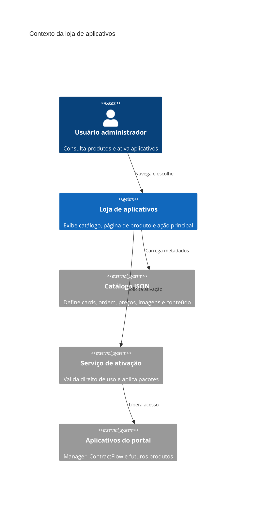

# RFC 004 - Loja de Aplicativos

**Status:** Rascunho  
**Data:** 2026-09-07  
**Extende:** [RFC 003 - Ativação de Aplicativos e Módulos](003-ativacao-de-aplicativos-e-modulos.md)

## Cenário

A RFC 003 definiu a intenção de separar a ativação de aplicativos da tela técnica `/Support/Package`, criando um fluxo mais adequado para contratação, ativação e reaplicação de módulos. Esta RFC detalha a experiência desejada para a loja de aplicativos, que será a porta de entrada visual para descoberta e ativação dos produtos disponíveis no portal.

A loja deve permitir que um usuário administrador veja os aplicativos disponíveis para seu repositório, entenda rapidamente o propósito de cada produto e execute a ação principal com clareza: ativar, informar chave, contratar, atualizar ou abrir o aplicativo.

O catálogo deve ser alimentado por uma estrutura JSON localizada em `App\Static\Menu`. Esse arquivo deve conter a coleção de cards e seus metadados comerciais e visuais, permitindo publicar novos itens no catálogo sem criar uma tela nova para cada produto.

## Problema identificado

Sem uma loja dedicada, a ativação de aplicativos fica dependente de uma tela técnica, linguagem de pacote e entrada manual de chave. Isso dificulta descoberta, comparação entre produtos e entendimento do valor de cada aplicativo.

Também há risco de multiplicação de telas específicas. Cada novo produto poderia exigir controller, view completa, menu e lógica própria apenas para apresentar uma página comercial simples. Esse custo não escala bem para uma loja com vários aplicativos.

Outro ponto é a experiência visual. O portal usa SBAdmin como base administrativa, mas alguns produtos podem precisar de identidade visual própria, imagens comerciais, temas ou assets comprados. O catálogo deve prever onde essas informações ficam e como a loja pode renderizá-las sem misturar o conteúdo de marketing com regras de ativação.

## Proposta de solução

Criar uma loja de aplicativos com duas experiências principais:

- uma página de catálogo com alternância entre visualização em cards e visualização em lista;
- uma página genérica de produto, capaz de carregar conteúdo específico do produto selecionado.

A página de catálogo deve ler um JSON em `App\Static\Menu`, por exemplo `AppStore.json`, contendo a coleção de aplicativos exibidos. Cada item deve conter, no mínimo:

- `title`: título do card.
- `description`: descrição curta para o catálogo.
- `tag`: classificação comercial, como `Gratuito` ou `Pago`.
- `price`: valor exibido.
- `term`: prazo ou modelo de contratação.
- `order`: ordem de exibição.

Elementos adicionais recomendados para personalizar e operar a loja:

- `app_id`: identificador do aplicativo em `CasApp`.
- `product_key`: identificador do pacote técnico, quando diferente do aplicativo.
- `slug`: identificador amigável para URL da página do produto.
- `status`: estado de publicação no catálogo, como `published`, `draft` ou `hidden`.
- `badge`: selo visual, como `Novo`, `Popular`, `Beta`, `Recomendado` ou `Em breve`.
- `category`: agrupamento, como `Gestão`, `Contratos`, `Financeiro`, `Operação`, `Integrações` ou `Suporte`.
- `summary`: frase curta de impacto para lista e destaque.
- `features`: lista curta de recursos principais.
- `audience`: público indicado, como `Administradores`, `Equipe operacional`, `Financeiro` ou `Comercial`.
- `cover_image`: imagem principal do card.
- `icon`: ícone do produto ou classe de ícone.
- `theme`: tema visual sugerido, como `SBAdmin`, `Martex` ou outro pacote visual disponível.
- `assets_path`: diretório base de imagens e recursos visuais do produto.
- `details_view`: caminho da section específica usada na página do produto.
- `activation_required`: indica se precisa de chave, contrato ou ativação direta.
- `activation_mode`: `free`, `token`, `contract`, `trial` ou `external`.
- `launch_url`: rota para abrir o aplicativo após ativado.
- `learn_more_url`: rota da página exclusiva do produto.
- `sort_group`: agrupamento adicional para ordenação editorial.

O campo `term` deve suportar modelos além de meses fixos. Opções recomendadas:

- `Gratuito`: sem cobrança.
- `Único`: pagamento único ou liberação permanente.
- `Mensal`: cobrança recorrente mensal.
- `Trimestral`: contratação por 3 meses.
- `Semestral`: contratação por 6 meses.
- `Anual`: contratação por 12 meses.
- `Trial`: período de avaliação.
- `Sob consulta`: condição comercial definida fora do portal.
- `Por consumo`: cobrança proporcional ao uso.

O campo `tag` deve ser tratado como uma indicação visual rápida, não como única regra de ativação. Sugestões de tags:

- `Gratuito`: aplicativo sem cobrança.
- `Pago`: exige contratação.
- `Trial`: avaliação temporária.
- `Incluso`: já faz parte do plano atual.
- `Beta`: produto em validação.
- `Novo`: lançamento recente.
- `Popular`: destaque editorial.
- `Sob consulta`: depende de negociação.

A visualização em cards deve priorizar descoberta e marketing. Cada card deve conter imagem, título, descrição curta, tag, preço, prazo, selo opcional e botão de ação. A visualização em lista deve priorizar comparação rápida, com colunas como produto, categoria, tag, valor, prazo, status e ação.

A página exclusiva do produto deve ser um programa genérico. Ela recebe o `slug` ou `app_id`, carrega os metadados do catálogo e inclui uma `section` específica do produto no corpo da página. Assim, cada produto pode ter uma apresentação própria sem exigir uma tela completa nova.

Essa página deve manter a ativação no topo como objetivo principal. A primeira área da tela deve exibir nome do produto, resumo, imagem ou banner, preço/prazo e o mesmo componente de ação usado no card. O restante da página pode apresentar benefícios, recursos, imagens, casos de uso, perguntas frequentes e requisitos.

Os assets visuais devem ficar em diretórios previsíveis por produto e tema. Exemplos:

- `App\Views\SBAdmin\AppStore\Products\<Produto>Section.php`
- `App\Views\Martex\AppStore\Products\<Produto>Section.php`
- `Public\SBAdmin\images\products\<produto>\`
- `Public\Martex\images\products\<produto>\`

Quando um produto declarar `theme: Martex`, a loja pode usar classes, imagens e composições visuais desse pacote. Quando não houver tema específico, a apresentação deve usar SBAdmin.

O JSON do catálogo não deve substituir o pacote técnico de ativação. O catálogo descreve como vender e apresentar o produto. O pacote em `App\Static\Rules\<Aplicativo>` descreve como configurar o repositório tecnicamente. Esses dois papéis devem permanecer separados.

## Alternativas consideradas

### Criar uma tela completa para cada produto

Permite liberdade visual máxima, mas aumenta o custo de manutenção. Cada aplicativo novo exigiria estrutura própria, mesmo quando a necessidade fosse apenas apresentar conteúdo comercial.

### Usar somente a tela de cards, sem página de produto

Reduz esforço inicial, mas limita a comunicação de valor. Produtos mais complexos, como ContractFlow, precisam de uma página própria para explicar recursos, imagens, condições e benefícios antes da ativação.

### Usar o mesmo JSON do pacote técnico para montar a loja

Evita um segundo arquivo, mas mistura responsabilidades. O pacote técnico precisa ser estável, validável e orientado à configuração. A loja precisa de textos, imagens, ordem editorial, preços e informações comerciais que podem mudar em outro ritmo.

### Criar catálogo em banco de dados desde o início

É uma evolução válida para gestão administrativa pelo portal, publicação dinâmica e controle por cliente. Porém, para a primeira fase, um JSON versionado em `App\Static\Menu` é mais simples, rastreável e compatível com o padrão atual de menus e regras estáticas.

### Renderizar apenas um tema visual

Simplifica a implementação, mas limita a apresentação comercial. Permitir temas como SBAdmin e Martex cria espaço para produtos com identidade própria, mantendo um fallback administrativo consistente.

## Decisão

Criar uma loja de aplicativos como extensão da RFC 003.

A loja deve usar um arquivo JSON em `App\Static\Menu` para alimentar os cards, ordenar produtos e definir metadados comerciais e visuais. O catálogo deve permitir visualização em cards e lista, com alternância clara para o usuário.

Cada produto deve poder abrir uma página genérica de detalhes, carregada por `slug` ou `app_id`, com uma `section` específica para o conteúdo de marketing. O componente de ativação deve ser reutilizado tanto no card quanto no topo da página do produto.

O catálogo deve permanecer separado dos pacotes técnicos de ativação. A loja apresenta e orienta a decisão do usuário; o serviço de ativação valida direito de uso e aplica os pacotes conforme definido na RFC 003.

Na primeira fase, o catálogo deve ser arquivo estático versionado. Em fase futura, ele poderá migrar para banco de dados ou painel administrativo se houver necessidade de edição comercial frequente.
